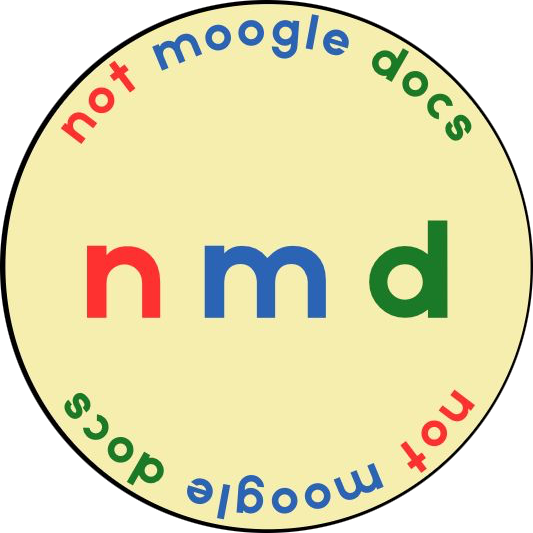

# Project: not moogle docs



## 🔴 **Project Overview**

The goal of this project is to combine the powerful note-taking and linking features of **Obsidian** with the collaborative capabilities of platforms like **Google Docs**. The system is designed to allow users to work together without relying on the paid Obsidian Sync service.

## 📂 **Features**
- Users can edit their notes simultaneously.
- Users can create **links between notes**, which are visualized through an **interactive knowledge graph**.
- **In-app notifications** allow users to invite friends directly to collaborate on notes and vaults.
- Each user is assigned a specific **role**:
  - **Owner**
  - **Editor**
- Users can only access notes where they are **participants** and can view or edit content based on their assigned role.
- The **role-based authorization** system simplifies access control and makes team collaboration more organized and secure.
- A **modular and user-friendly design** hides technical complexity behind a clean and intuitive interface.

## 👨🏾‍🔧 **Technologies Used:**

CHAT IS MISSING! (FIREBASE API IS MISSING!)

### **⚙️ Backend:**

| **Technology**        | **Purpose**   | **Source** | 
|--------------------| ---------- | ------------------ |
| Spring Boot 2.4 | A Java-based framework that simplifies backend development, particularly for building RESTful APIs. | [SpringBoot](https://docs.spring.io/spring-boot/docs/2.4.0/reference/htmlsingle/)| 
| JWT | A secure and compact mechanism for transmitting user session information. Enables stateless authentication between client and server. | [JWT](https://jwt.io/introduction) | 
| MariaDB | A fast and reliable open-source relational database. Stores core application data such as users, vaults, notes, and permission settings. | [MariaDB](https://mariadb.org/documentation/) | 
| Yjs | A CRDT-based collaboration framework enabling concurrent editing by multiple users. Facilitates real-time synchronization of shared documents. | [Yjs](https://yjs.dev/) | 
| Docker | A platform for building, shipping, and running applications in isolated containers. Ensures consistent development and deployment environments across systems. | [Docker](https://docs.docker.com/) | 
| WebSocket | A communication protocol for real-time, bidirectional messaging between the browser and server. Enables features like collaborative note editing. | [WebSocket](github.com/websockets/ws) | 

## **👨🏼‍💻 Main Components:**

### **⚙️ Backend:**

| **Component**        | **Purpose**   | **Link** | 
|--------------------| ---------- | ------------------ |
| UserController | Handles user authentication and registration. | []()| 
| Vault Controller | Manages CRUD operations for vaults, including listing and creating. |  | 
| Note Controller | Handles all note-related endpoints under a vault. | | 
| Vault Permission Controller | Manages sharing logic by assigning user roles (OWNER, EDITOR) to vaults. | | 
| JwtFilter & JwtUtil |Extracts and validates the token for secured requests. |  | 

## **👩🏻‍🚀 Launch & Deployment:**

### **⚙️ Backend:**
1️⃣ **Build the project**
```
docker-compose build 
```
2️⃣ **Run the application**
```
docker-compose up
```
3️⃣ **Run backend tests**
```
./gradlew test
```
### **🕸️ Websocket Development:**

First expose port 8080 in Dockerfile and change port 1234 to 8080 in server.js; also set isProduction to true. 

Then run:
```
cd yjs/
```
```
gcloud builds submit --tag gcr.io/sopra-fs25-group-42-server/yjs-server:latest.
```
```
3. gcloud run deploy yjs-server \
```

```
  --image gcr.io/sopra-fs25-group-42-server/yjs-server:latest \
  --platform managed \
  --region europe-west6 \
  --allow-unauthenticated \
  --memory 1Gi \
  --concurrency 50 \
  --timeout 3600 \
  --min-instances 1 \
  --max-instances 3
```
---
## 🌊 **Illustrations and Flow of the App:**

### **1-) Landing → Auth:**

[screenshot]

- User clicks Login / Register (Enters username + password)

### **2-) Vaults Dashboard:**

[screenshot]

- User sees my vaults list.
- User sees shared vaults.
- User can create new vaults.

#### **2.1-) Vault → Notes:**
- Click the vault card (notes button) → routed to /vaults/[id]/notes
- (For further details of notifications page please check section 6)
#### **2.2-) Vault → Profile:**
- Click the profile button → routed to /profile/[id]
- (For further details of profile page please check section 3)

#### **2.3-) Vault → Vault_Settings:**
- Click the settings button → routed to / /vaults/[vault_id]/settings

**Functionality (Vault Settings Page)**: 
[screenshot]

### **3-) Profile Page:**
[screenshot]
- Sees user_id, creation_date and status.

#### **3.1-) Profile → Dashboard:**
- User can see all registered users and their status.

#### **3.2-) Profile → Notifications:**
- User can see all vault invitations
- (For further details of notifications page please check section 5)

### **4-) Vault Settings Page:**
[screenshot]
- User can change the vault name.
- User can send invitations to invite new users to work in same vault. (Permissions Card)

### **5-) Notifications Page:**
[screenshot]
- User can see all invitations that have received.

### **6-) Notes page:**
[screenshot]
- User can create new notes.

#### **6.1-) Notes → Note_Settings:**
- Click the notes card (settings button) → routed /vaults/[vault_id]/notes/[notes_id]/settings
- (For further details of notes settings page please check section X)

#### **6.2-) Notes → Editor:**
- Click the notes card (editor button) → routed /vaults/[vault_id]/notes/[notes_id]
- (For further details of editor page please check section X)

#### **6.3-) Notes → Profile:**
- (We already mentioned in section 3.)

### **7-) Notes Settings page:**
[screenshot]

- User can change the note name.
- User can give a another user a role directly (without invitation, it's different than vault settings page)

### **8-) Editor page:**
[screenshot]

- User will see the basic markdown editor panel when they enter the editor page.
- In the left sliding window (green square), other notes in that spesific vault can be seen.
- In the right sliding window (blue square), idea linkage graph and chat can be seen.

## 🤝 **Want to Contribute?**

- We welcome contributions from the community! If you'd like to add new features, fix bugs, or improve documentation, follow the steps below:

1. Fork the repository
2. Create a new feature branch (`git checkout -b feature/my-contribution`)
3. Commit your changes and push to your fork
4. Open a pull request describing your changes

### 📈 **Potential Improvements:**

#### **PDF Upload & Note Extraction:**
- Enable users to upload a PDF and automatically generate notes from its content (can be ideal for research papers), reports, or contracts.

#### **Role Change Notifications:**
- Instead of instantly updating roles on the notes settings page, show a user-friendly notification when someone’s permission level is changed.

## 🏆 **Authors and Acknowledgement:**

- This project was developed as part of the FS25 Software Engineering Lab at the University of Zurich.
- Special thanks to Timon Leupp for his continuous support and valuable guidance throughout the project.

### 👷‍♀️👷‍♂️ **Authors**:

| **Contributor**        | **ID**   | **Github Page** | 
|--------------------| ---------- | ------------------ |
| Klevis Nrecaj |22-725-832| [Klevis](https://github.com/Klevis27) | 
| Oliver Hostettler |22-717-003| [Oliver](https://github.com/AntWarz) |
| Sven Vestli |20-916-110| [Sven](https://github.com/SvenVest) |
| Elif Deniz İsbuga |24-745-911| [Elif](https://github.com/elifdenizi) |
| Necati Furkan Colak |24-746-323| [Necati](https://github.com/nfcolak) |


## **⚖️ License:**

MIT License

Copyright (c) 2025 Klevis27

Permission is hereby granted, free of charge, to any person obtaining a copy
of this software and associated documentation files (the "Software"), to deal
in the Software without restriction, including without limitation the rights
to use, copy, modify, merge, publish, distribute, sublicense, and/or sell
copies of the Software, and to permit persons to whom the Software is
furnished to do so, subject to the following conditions:

The above copyright notice and this permission notice shall be included in all
copies or substantial portions of the Software.

THE SOFTWARE IS PROVIDED "AS IS", WITHOUT WARRANTY OF ANY KIND, EXPRESS OR
IMPLIED, INCLUDING BUT NOT LIMITED TO THE WARRANTIES OF MERCHANTABILITY,
FITNESS FOR A PARTICULAR PURPOSE AND NONINFRINGEMENT. IN NO EVENT SHALL THE
AUTHORS OR COPYRIGHT HOLDERS BE LIABLE FOR ANY CLAIM, DAMAGES OR OTHER
LIABILITY, WHETHER IN AN ACTION OF CONTRACT, TORT OR OTHERWISE, ARISING FROM,
OUT OF OR IN CONNECTION WITH THE SOFTWARE OR THE USE OR OTHER DEALINGS IN THE
SOFTWARE.
